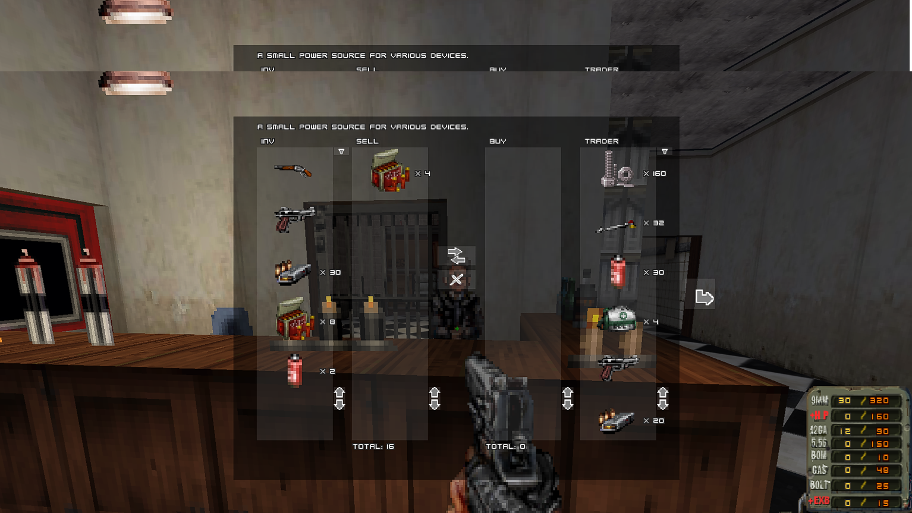

# Ashes-f2-trading-system

A trading system just like in fallout 2? IN MY ASHES?!



## To implement it into your project

 1. Put everything from the `GameInfo` section into the `GameInfo` section of your mod's `MAPINFO` lump.
 2. Put ```#include "zscript/AshesTradingSystem.zc"``` into `ZSCRIPT.ZC`. Don't forget to put `AshesTradingSystem.zc` into `zscript/` folder of your mod.
 3. Put everything that's left from every folder into the corresponding folder of your mod.
 
OR just use mod launcher and launch this archive as a .pk3 with your mod.


## How to use:
 1. Describe all tradeable items in TRADEITEMS lump like this:

		cls | name | description | price | icon | class (optional)

 for example:
		 
		policepistol | Police Pistol | Standard sidearm. | 120 | 590GA0 | weapon
		chips | Chips | Trade currency. | 1 | SEL1D0
		batteryreload | Batteries | A small power source for various devices. | 10 | IBTYA0
		foodtin1 | Food | This could be tasty. Or edible. | 5 | BON1A0
		ninemilammo | 9mm Ammo | Ammo for 9mm weapons. | 2 | CLIPA0 | ammo
		firstaid | First aid kit | This might come in handy if you're bleeding. | 10 | INVMA0
		pipebomb | Pipebomb | A long, cold cylinder with explosive contents. | 10 | ROCKA0 | weapon

 item class is used mostly for dynamic filters. If it's empty, item is "misc" by default. 
	 
 2. Describe shops in TRADERS lump like this:

		trader <unique_shop_key>, <greed_modifier(optional)>
		{
		 <item1_cls>, <amount>, <custom_price(optional)>
		 <item2_cls>, <amount> 
		}

 for example:

		trader Vance
		{
			policepistol, 1, 99 // look, a custom price!
			chips, 250
			foodtin1, 6
		}
		
		trader Jimmy, 1.2 // all prices are 20% higher, cause his <greed_modifier> is 1.2
		{
			chips, 160
			batteryreload, 30
			firstaid, 4
			policepistol, 1, 111 // custom price again
			pipebomb, 2,  15 // and again
		}

 3. In your conversations, put `[trade <unique_shop_key>]` into your character's reply where you want trading to be initiated.
	
 for example:
	in LANGUAGE lump - `TXT_WALKER_207 = "Let me see what you have. [trade Vance]";`
 
 The `"[-]"` tag is not displayed in the dialog - you'll see only `"Let me see what you have.".`
 Choosing this reply in coversation will forcefully interrupt it and open trade interface, loading shop with "Vance" shop key.

## Things to note:

There's a global vendor price modifier in `AshesTradingSystem.zc`: GLOBAL_PRICE_MULT = 1. Change it if you want to make all vendors a little greedier.
Refer to TRADERS and TRADEITEMS lumps for detailed information.
Have fun.
